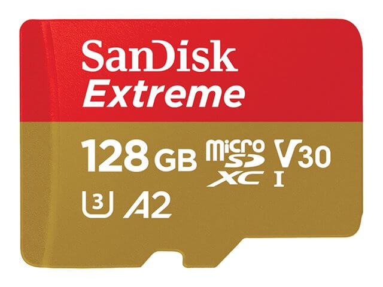

Drone tilbehør kan forbedre din oplevelse når du er ude og flyve med din drone. Vi har derfor lavet en liste over de fem bedste drone tilbehør til din DJI Mavic 2 Pro. Med dem vil din drone oplevelse blive taget til det næste niveau.

## 1. DJI Intelligent Flight Battery

Når du er ude of flyve med din drone og pludselig opdager at batteriet er ved at løbe kan det være irreterende ikke at have et ekstra batteri liggende.

Hvis du køber en DJI Mavic 2 uden <a href="https://www.partner-ads.com/dk/klikbanner.php?partnerid=29353&bannerid=55216&htmlurl=https://www.hubshop.dk/shop/dji-mavic-2-pro-combo-startpakke/" target="_blank">Fly more combo</a> vil du kun få tildelt et enkelt batteri.

Det er ikke særlig praktisk hvis du fx er ude og filme og du opdager at batteriet er ved at løbe ud.

Det er derfor anbefalet at have et ekstra batteri med sig når man er ude og flyve.

Hvis du har planer om at købe et ekstra batteri er det en god ide at gå efter <a href="https://www.partner-ads.com/dk/klikbanner.php?partnerid=29353&bannerid=55216&htmlurl=https://www.hubshop.dk/shop/dji-mavic-2-pro-combo-startpakke/" target="_blank">Fly more combo</a>.

Det skyldes du får en hel masse andet tilbehør såsom skuldertask og ladehub udover ekstra batteri.

### Tips om Mavic 2 batteri

 <iframe width="340" height="200" style="          position: absolute,
          top: 0,
          left: 0,
          width: 100%,
          height: 100%"
src="https://www.youtube.com/embed/ZdCabk1WCGM" SameSite=None
frameborder="0" 
allow="accelerometer; autoplay; encrypted-media; gyroscope; picture-in-picture" 
allowfullscreen></iframe>

<a href="#" target="_blank"  style="background-color:#f44336; 
	border-radius:28px;
	border:1px solid #f44336;
	display:inline-block;
	cursor:pointer;
	color:#ffffff;
	font-family:Arial;
	font-size:17px;
	padding:16px 31px;
	text-decoration:none;
	text-shadow:0px 1px 0px #2f6627;" >Tjek Pris Her</a>

## 2. DJI ND Filters

DJI ND Filtre er et af det mest essentielle tilbehør du kan eje. Det skyldes du med dem kan du forbedre dine drone billeder og gøre dem mere cinematisk.

### Videoanmeldelse

 <iframe width="340" height="200" style="          position: absolute,
          top: 0,
          left: 0,
          width: 100%,
          height: 100%"
src="https://www.youtube.com/embed/HBQEO-KD1nc" SameSite=None
frameborder="0" 
allow="accelerometer; autoplay; encrypted-media; gyroscope; picture-in-picture" 
allowfullscreen></iframe>

<a href="#" target="_blank"  style="background-color:#f44336; 
	border-radius:28px;
	border:1px solid #f44336;
	display:inline-block;
	cursor:pointer;
	color:#ffffff;
	font-family:Arial;
	font-size:17px;
	padding:16px 31px;
	text-decoration:none;
	text-shadow:0px 1px 0px #2f6627;" >Tjek Pris Her</a>

## 3. DJI Skuldertaske

DJI Mavic Air er mere den mest forbrugervenlige i forhold til de andre modeller. Det skyldes den er mindre og er nemmere at bære rundt på så.

I forhold til hvor svært det er at flyve drone kan det siges med det samme at det ikke blive noget problem.

Dens tophastighed 42 km/t og dens flyvetid i følge DJI når lige op på 21 min. Dertil har den 3 sensorer, 2 i fronten, 2 i bagenden og 2 i bunden som hjælper med undgå sammenstød.

Den har 8gb lagerplads og du kan tilføje et sd kort. Kammeraet kan tage flottet panorama billeder og kvalitet er i top.

DJI Mavic Air er et godt alternativ for dig som lige er startet med at flyve med droner og ikke er parat til at gå efter de dyrere DJI droner.

DJI Mavic Air har en god balance i forhold til pris, ydeevne og kvalitet.

Pros

- Lille og nem at bære rundt på
- forbedret flyvetid
- God for nybegyndere
- Billeder og video i 4k

Cons

- 21 min. flyvetid mindre end Mavic pro
- Kortere flyve distance

### Videoanmeldelse

 <iframe width="340" height="200" style="          position: absolute,
          top: 0,
          left: 0,
          width: 100%,
          height: 100%"
src="https://www.youtube.com/embed/MM8mXS3Wiqs" SameSite=None
frameborder="0" 
allow="accelerometer; autoplay; encrypted-media; gyroscope; picture-in-picture" 
allowfullscreen></iframe>

<a href="#" target="_blank"  style="background-color:#f44336; 
	border-radius:28px;
	border:1px solid #f44336;
	display:inline-block;
	cursor:pointer;
	color:#ffffff;
	font-family:Arial;
	font-size:17px;
	padding:16px 31px;
	text-decoration:none;
	text-shadow:0px 1px 0px #2f6627;" >Tjek Pris Her</a>

### 4. SanDisk Extreme Pro - 128GB

Mavic Pro Platinum har en lysere design end den originale Mavic Pro, men er ellers fysisk identisk.

DJI Mavic Pro Platinum er super nem og flyve og har også et begynder niveau for dem som lige at startet med at flyve med droner.

Den har lys hjælper dig med at orientere flyets retning, når du flyve med dronen.

Kameraet kan tage billeder i 4k og er nem at bære rundt på. Når den foldes, passer Mavic Pro let i en kamerataske.

Plastikcoveret, der beskytter kameraet, kan være på eller fjernes under flyvning.

Dens flyvetid er i følge DJI på omkring 30 min. Dronens støjniveau er væsentlig mindre end tidligere versioner.

Controlleren, der følger med Mavic pro platinum, er også den samme enhed, du får med den originale Mavic pro.

Sensorerne er placeret i bunden og i front som hjælper med at undgå koalitioner.

DJI Mavic Pro Platinum er en fantastisk drone, du kan købe og et god valg for de fleste luftfotografer.

Pros

- Mindre støjende
- Øget flyvetid
- 4k video

Cons

- Har ikke sensorer i bagenden

### Videoanmeldelse

 <iframe width="340" height="200" style="          position: absolute,
          top: 0,
          left: 0,
          width: 100%,
          height: 100%"
src="https://www.youtube.com/embed/yg6EXVXwwK4" SameSite=None
frameborder="0" 
allow="accelerometer; autoplay; encrypted-media; gyroscope; picture-in-picture" 
allowfullscreen></iframe>

<a href="#" target="_blank"  style="background-color:#f44336; 
	border-radius:28px;
	border:1px solid #f44336;
	display:inline-block;
	cursor:pointer;
	color:#ffffff;
	font-family:Arial;
	font-size:17px;
	padding:16px 31px;
	text-decoration:none;
	text-shadow:0px 1px 0px #2f6627;" >Tjek Pris Her</a>

## 5. DJI Mavic 2 Ladehub

Mavic Pro Platinum har en lysere design end den originale Mavic Pro, men er ellers fysisk identisk.

DJI Mavic Pro Platinum er super nem og flyve og har også et begynder niveau for dem som lige at startet med at flyve med droner.

Den har lys hjælper dig med at orientere flyets retning, når du flyve med dronen.

Kameraet kan tage billeder i 4k og er nem at bære rundt på. Når den foldes, passer Mavic Pro let i en kamerataske.

Plastikcoveret, der beskytter kameraet, kan være på eller fjernes under flyvning.

Dens flyvetid er i følge DJI på omkring 30 min. Dronens støjniveau er væsentlig mindre end tidligere versioner.

Controlleren, der følger med Mavic pro platinum, er også den samme enhed, du får med den originale Mavic pro.

Sensorerne er placeret i bunden og i front som hjælper med at undgå koalitioner.

DJI Mavic Pro Platinum er en fantastisk drone, du kan købe og et god valg for de fleste luftfotografer.

Pros

- Mindre støjende
- Øget flyvetid
- 4k video

Cons

- Har ikke sensorer i bagenden

#### Video om hvordan man oplader med ladehuben.

 <iframe width="340" height="200" style="          position: absolute,
          top: 0,
          left: 0,
          width: 100%,
          height: 100%"
src="https://www.youtube.com/embed/eP1u6EZScAc" SameSite=None
frameborder="0" 
allow="accelerometer; autoplay; encrypted-media; gyroscope; picture-in-picture" 
allowfullscreen></iframe>

<a href="#" target="_blank"  style="background-color:#f44336; 
	border-radius:28px;
	border:1px solid #f44336;
	display:inline-block;
	cursor:pointer;
	color:#ffffff;
	font-family:Arial;
	font-size:17px;
	padding:16px 31px;
	text-decoration:none;
	text-shadow:0px 1px 0px #2f6627;" >Tjek Pris Her</a>    

<a href="https://bedstedronetilprisen/bedste-drone-til-prisen">Tjek vores bud på de bedste droner til prisen</a>
