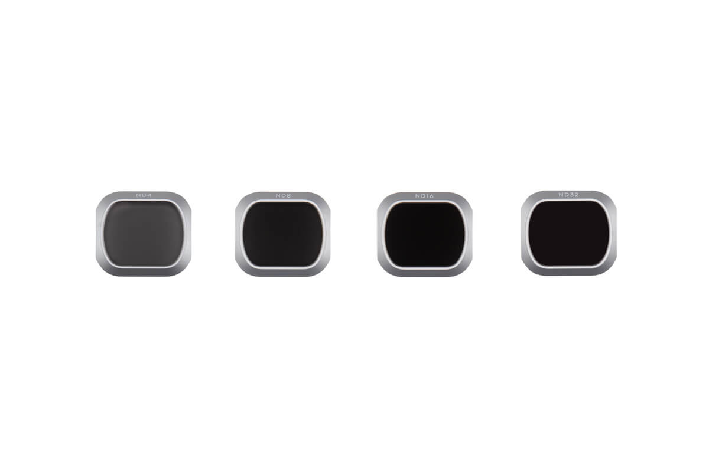
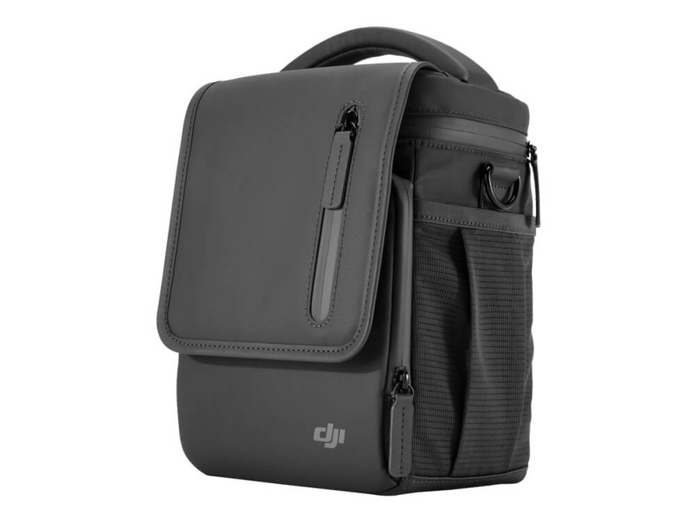
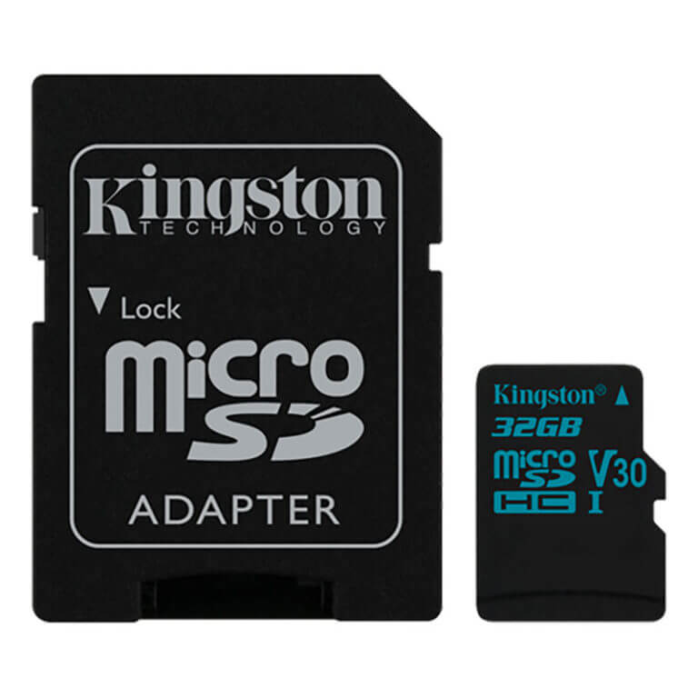
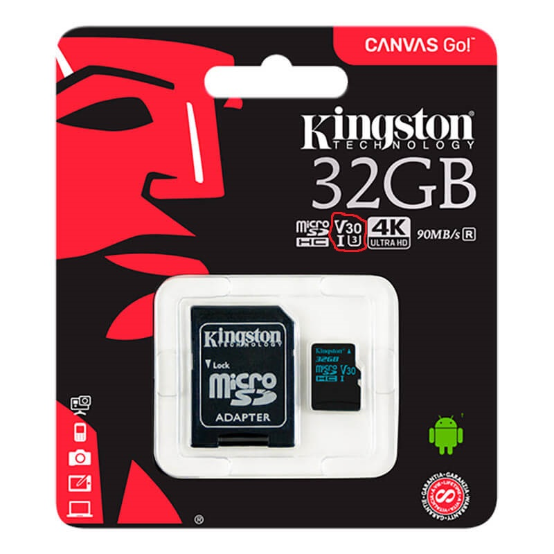
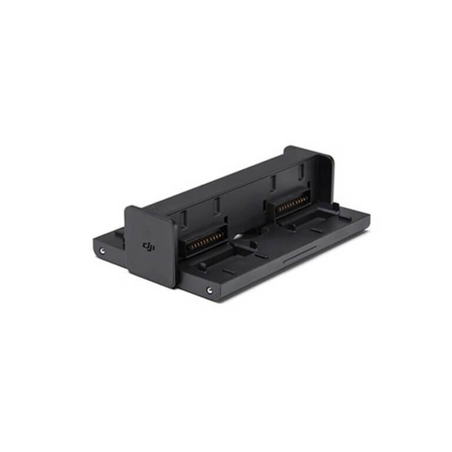

Drone tilbehør kan forbedre din oplevelse når du er ude og flyve med din drone. Vi har derfor lavet en liste over de fem bedste drone tilbehør til din DJI Mavic 2 Pro. Med dem vil din drone oplevelse blive taget til det næste niveau.

## 1. DJI Intelligent Flight Battery

Når du er ude of flyve med din drone og pludselig opdager at batteriet er ved at løbe kan det være irreterende ikke at have et ekstra batteri liggende.

Hvis du køber en DJI Mavic 2 uden <a href="https://www.partner-ads.com/dk/klikbanner.php?partnerid=29353&bannerid=55216&htmlurl=https://www.hubshop.dk/shop/dji-mavic-2-pro-combo-startpakke/" target="_blank">Fly more combo</a> vil du kun få tildelt et enkelt batteri.

Det er ikke særlig praktisk hvis du fx er ude og filme og du opdager at batteriet er ved at løbe ud.

Det er derfor anbefalet at have et ekstra batteri med sig når man er ude og flyve.

Hvis du har planer om at købe et ekstra batteri er det en god ide at gå efter <a href="https://www.partner-ads.com/dk/klikbanner.php?partnerid=29353&bannerid=55216&htmlurl=https://www.hubshop.dk/shop/dji-mavic-2-pro-combo-startpakke/" target="_blank">Fly more combo</a>.

Det skyldes du får en hel masse andet tilbehør såsom skuldertask og ladehub udover ekstra batteri.

### Tips om Mavic 2 batteri

 <iframe width="340" height="200" style="          position: absolute,
          top: 0,
          left: 0,
          width: 100%,
          height: 100%"
src="https://www.youtube.com/embed/ZdCabk1WCGM" SameSite=None
frameborder="0" 
allow="accelerometer; autoplay; encrypted-media; gyroscope; picture-in-picture" 
allowfullscreen></iframe>

<a href="https://track.adtraction.com/t/t?a=1319510587&as=1433021260&t=2&tk=1&url=https://www.computersalg.dk/i/4812607/dji-intelligent-flight-battery?sq=Mavic+2+Intelligent+Flight+Battery" target="_blank"  style="background-color:#f44336; 
	border-radius:28px;
	border:1px solid #f44336;
	display:inline-block;
	cursor:pointer;
	color:#ffffff;
	font-family:Arial;
	font-size:17px;
	padding:16px 31px;
	text-decoration:none;
	text-shadow:0px 1px 0px #2f6627;" >Tjek Pris Her</a>

## 2. DJI ND Filters

DJI ND Filtre er et af det mest essentielle tilbehør du kan eje. Det skyldes du med dem kan du forbedre dine drone billeder og gøre dem mere cinematisk.

### Videoanmeldelse

 <iframe width="340" height="200" style="          position: absolute,
          top: 0,
          left: 0,
          width: 100%,
          height: 100%"
src="https://www.youtube.com/embed/HBQEO-KD1nc" SameSite=None
frameborder="0" 
allow="accelerometer; autoplay; encrypted-media; gyroscope; picture-in-picture" 
allowfullscreen></iframe>

<a href="https://www.partner-ads.com/dk/klikbanner.php?partnerid=29353&bannerid=67757&htmlurl=https://www.proshop.dk/Fotofiltre/DJI-ND-Filters-Set-ND481632/2696578" target="_blank"  style="background-color:#f44336; 
	border-radius:28px;
	border:1px solid #f44336;
	display:inline-block;
	cursor:pointer;
	color:#ffffff;
	font-family:Arial;
	font-size:17px;
	padding:16px 31px;
	text-decoration:none;
	text-shadow:0px 1px 0px #2f6627;" >Tjek Pris Her</a>

## 3. DJI Skuldertaske

DJI Skuldertaske er en moderne og kompakt taske som er meget praktisk til at bærer rundt på dit drone udstyr. Den har to lommer som kan bruges til at opbevare din fjernstyret controller.

På forsiden finder du en lomme som kan lynes op. Her kan du opbevarer dine micro sd kort eller ND filtre. Du kan også opbevarer op til fire batterier i tasken.

#### Video som viser hvordan du pakker dit udstyr i skuldertasken

 <iframe width="340" height="200" style="          position: absolute,
          top: 0,
          left: 0,
          width: 100%,
          height: 100%"
src="https://www.youtube.com/embed/MM8mXS3Wiqs" SameSite=None
frameborder="0" 
allow="accelerometer; autoplay; encrypted-media; gyroscope; picture-in-picture" 
allowfullscreen></iframe>

<a href="https://track.adtraction.com/t/t?a=1319510587&as=1433021260&t=2&tk=1&url=https://www.computersalg.dk/i/4718437/dji-skuldertaske-til-drone?sq=dji+skulder" target="_blank"  style="background-color:#f44336; 
	border-radius:28px;
	border:1px solid #f44336;
	display:inline-block;
	cursor:pointer;
	color:#ffffff;
	font-family:Arial;
	font-size:17px;
	padding:16px 31px;
	text-decoration:none;
	text-shadow:0px 1px 0px #2f6627;" >Tjek Pris Her</a>

### 4. Kingston Micro SD Kort - 32GB

Når det kommer til mikro sd kort er der nogle ting du bør være klar over. Det skyldes man ikke kun skal holde øje med hvor meget lagerplads den, men også hvor hurtig hukommelseskortet er.

På pakken kan man se der "U3" og "V30". Disse to specifikationer indikerer at data hurtigt kan blive transporteret til dit hukkommelseskortet når du filmer med din drone i 4K opløsning.

Hvis du køber en DJI Mavic 2 med <a href="https://www.partner-ads.com/dk/klikbanner.php?partnerid=29353&bannerid=55216&htmlurl=https://www.hubshop.dk/shop/dji-mavic-2-pro-combo-startpakke/" target="_blank">fly more combo</a> vil du få et gratis sd kort inkluderet.

<a href="https://www.partner-ads.com/dk/klikbanner.php?partnerid=29353&bannerid=55216&htmlurl=https://www.hubshop.dk/shop/kingston-micro-sd-kort-32gb-inkl-adaptor/" target="_blank"  style="background-color:#f44336; 
	border-radius:28px;
	border:1px solid #f44336;
	display:inline-block;
	cursor:pointer;
	color:#ffffff;
	font-family:Arial;
	font-size:17px;
	padding:16px 31px;
	text-decoration:none;
	text-shadow:0px 1px 0px #2f6627;" >Tjek Pris Her</a>

## 5. DJI Mavic 2 Ladehub

Med en ladehub, kan du oplade op til 4 drone batterier på én gang. Ladehub’en kan foldes sammen så den fylder mindre og kan samtidig opbevares i din DJI skulder taske.

#### Video om hvordan man oplader med ladehuben.

 <iframe width="340" height="200" style="          position: absolute,
          top: 0,
          left: 0,
          width: 100%,
          height: 100%"
src="https://www.youtube.com/embed/eP1u6EZScAc" SameSite=None
frameborder="0" 
allow="accelerometer; autoplay; encrypted-media; gyroscope; picture-in-picture" 
allowfullscreen></iframe>

<a href="https://www.partner-ads.com/dk/klikbanner.php?partnerid=29353&bannerid=55216&htmlurl=https://www.hubshop.dk/shop/ladehub-til-mavic-2/" target="_blank"  style="background-color:#f44336; 
	border-radius:28px;
	border:1px solid #f44336;
	display:inline-block;
	cursor:pointer;
	color:#ffffff;
	font-family:Arial;
	font-size:17px;
	padding:16px 31px;
	text-decoration:none;
	text-shadow:0px 1px 0px #2f6627;" >Tjek Pris Her</a>    

<a href="https://bedstedronetilprisen.dk/bedste-drone-til-prisen">Tjek vores bud på de bedste droner til prisen</a>
