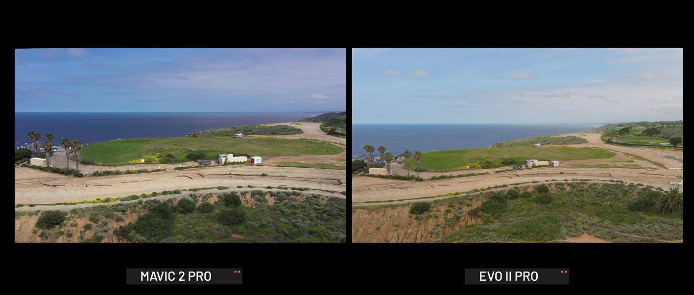

DJI Mavic 2 pro og Autel Evo 2 pro er begge fantastiske droner, men hvem af dem er den mest suveræne. Det vil vi prøve på at besvare ud af tre kriterier: Kamera opløsning, batterilevetid og fleksibilitet i luften.

## Kamera

Når det kommer kamera opløsningen så har Autel Evo 2 en højere opløsningen da den kan nå helt op til 6k sammenlignet med DJI mavic pro 4k.

Ser man dem side om side kan man hurtigt se at Evo 2 pro har en højere kontrast som gør at landskabet ser mere skarpt ud. Det kan være en cons for mange drone fotografer, men der er også en del som kan lide det.

DJI mavic pro er god til at balancere skarpheden som du selv har muligheden for at justere.

Evo har en højere farve mætning som gør at drone billedernes farver får en varm undertone, hvor DJI mavics har en køligere farvemætning som gør at detaljerne i drone billederne kan ses mere tydeligere.

## Batteri

I forhold til batterilevetid er det Autel Evo 2 Pro som løber med sejren eftersom dens batterilevetid er omkring 40 min under flyvning. Hvorimod DJI mavic 2 pro har batterilevetid på 31 min.

## Fleksibilitet

Til sidst har vi fleksibilitet under flyvning og der må det siges at DJI løber med sejren. Det skyldes at den under flyvningen slet ikke bevæge sig når den står stille i luften.

Derimod havde Autel Evo 2 en del sværere ved holde fokusset og der kan opstå tidspunkter hvor kameraet skal kalibreres i det det nogle gange kan drifte til siden.

 

 
<a href="https://www.partner-ads.com/dk/klikbanner.php?partnerid=29353&bannerid=77671&htmlurl=https://www.droneland.dk/da/home/491-dji-mavic-2-pro-startpakke-drone-med-hasselblad-kamera-og-tilbehorspakke-6958265174445.html" target="_blank"  style="background-color:#f44336; 
	border-radius:28px;
	border:1px solid #f44336;
	display:inline-block;
	cursor:pointer;
	color:#ffffff;
	font-family:Arial;
	font-size:17px;
	padding:16px 31px;
	text-decoration:none;
	text-shadow:0px 1px 0px #2f6627;" >Tjek DJI Mavic Pro Pris</a>

 

<a href="https://www.partner-ads.com/dk/klikbanner.php?partnerid=29353&bannerid=77671&htmlurl=https://www.droneland.dk/da/home/920-autel-evo-2-pro-6k1-drone-med-fuld-1-sony-sensor-og-6k-kamera-fly-more-bundle-6924991101024.html" target="_blank"  style="background-color:#f44336; 
	border-radius:28px;
	border:1px solid #f44336;
	display:inline-block;
	cursor:pointer;
	color:#ffffff;
	font-family:Arial;
	font-size:17px;
	padding:16px 31px;
	text-decoration:none;
	text-shadow:0px 1px 0px #2f6627;" >Tjek Autel EVO 2 Pro Pris</a>

 
<a href="https://bedstedronetilprisen.dk/bedste-drone-til-prisen" target="_blank">Tjek også vores bud på de bedste drone i 2020</a>
