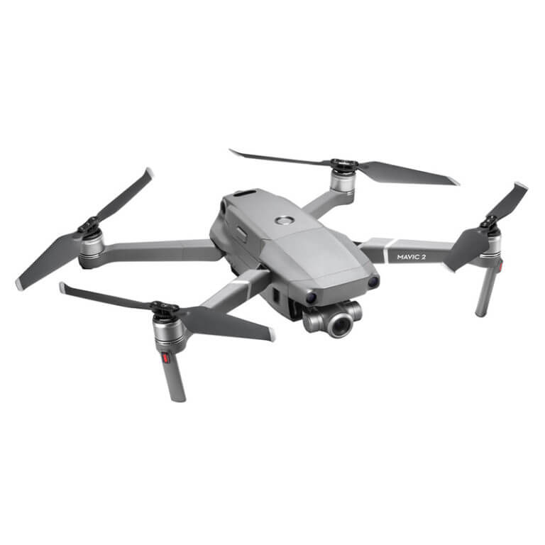

At flyve med droner er en spændende oplevelse, og det kan også hjælpe dig med at tage flotte landskabsbilleder. Der er dog mange droner på markedet, så hvordan kan du finde ud af, hvad der er den bedste for dig? Her har du en liste med de bedste DJI droner, samt en liste over deres funktioner og fordele.

## 1. DJI Mavic 2 Pro - Fly More Combo

DJI Mavic pro er et stor navn på dronemarkedet og alle deres produkter er intet mindre end fremragende. Hvis du ser på Mavic Pro du vil se endnu en fantastisk DJI-drone
foran dig.

Mavic 2 pro har flere innovationer, f.eks er
kameraet nu meget større. Du har flere sensorer som hjælper med at undgå koalitioner. Dertil er hele designet meget mere kompakt

Denne model er hurtigere og meget mere støjsvag end
den originale Mavic pro og den vejer ca. 297 gram. Det gør at den passer ind i enhver typerygsæk endda en håndtaske.

Med denne drone får du 8 gigabyte lagring samt et microSD-slot, der kan gemme op til 128 gigabyte ekstra plads.

Du kan overføre dine fotos og optagelser til din computer ved hjælp af USBC-port, du kan endda tilslutte din
drone til en computer for at opdatere dens firmware.

DJI Mavic 2 Pro er den bedste drone på markedet med overlegen billed- og videokvalitet, flere sensorer, som hjælper med at undgå forhindringer og fremragende batterilevetid.

Pros

- Bedste drone med kamera
- Lavere støjniveau
- Øget hastighed
- Længere batterilevetid
- Billeder og video i 4k

Cons

- PPI er ikke særlig høj
- Ingen tekst til tale

### Videoanmeldelse

 <iframe width="340" height="200" style="          position: absolute,
          top: 0,
          left: 0,
          width: 100%,
          height: 100%"
src="https://www.youtube.com/embed/q1Hks_NieMk" SameSite=None
frameborder="0" 
allow="accelerometer; autoplay; encrypted-media; gyroscope; picture-in-picture" 
allowfullscreen></iframe>

<a href="https://www.partner-ads.com/dk/klikbanner.php?partnerid=29353&bannerid=55216&htmlurl=https://www.hubshop.dk/shop/dji-mavic-2-pro-combo-startpakke/" target="_blank"  style="background-color:#f44336; 
	border-radius:28px;
	border:1px solid #f44336;
	display:inline-block;
	cursor:pointer;
	color:#ffffff;
	font-family:Arial;
	font-size:17px;
	padding:16px 31px;
	text-decoration:none;
	text-shadow:0px 1px 0px #2f6627;" >Tjek DJI Mavic Pro Pris</a>

## 2. DJI Mavic 2 Zoom - Fly More Combo

Det første du bemærker ved DJI Mavic 2 Zoom er dens design. Den vejer mere end tidligere DJI pro modeller. Batteriet er større som giver mere flyvetid.

Dens største feature er helt klart dens optiske zoom som kan kontrolleres med din remote controller. Med den kan du zoome ind og ud hvor overgangen føles meget glat.

2 led lygter et tilsluttet på bunden af dronen. De kan slukkes og tændes ved hjælp af din remote controller. Med dem kan du spotte din drone i selv dagslys og om aftenen.

Dronens hastighed har også set en forbedring. Den har nu en top hastighed på 72 km/t og dens flyvetiden er i følge DJI firmaet på 31 min.

Dens kamera sensorer bruger det samme kamera som den tidligere Mavic Pro hvilket er en smule ærgeligt. Ikke det stor mindre kan du stadig tage flotte billeder, men ikke i så høj kvalitet som Mavic 2 Pro.

Alt i alt er Mavic 2 Zoom en faktisk drone som er blevet forbedret på flere fronter. Med et moderne design og et godt kamera er du godt klædt på til at få taget nogle gode landskabsbilleder og video timelapses.

Pros

- Optisk zoom
- Mere flyvetid
- 2 led lygter så dronen hurtigt kan spottes
- Forbedret batterilevetid
- Billeder og video i 4k

Cons

- Kameraet er den samme som den originale Mavic Pro

### Videoanmeldelse

 <iframe width="340" height="200" style="          position: absolute,
          top: 0,
          left: 0,
          width: 100%,
          height: 100%"
src="https://www.youtube.com/embed/B_xOgjoCKZM" SameSite=None
frameborder="0" 
allow="accelerometer; autoplay; encrypted-media; gyroscope; picture-in-picture" 
allowfullscreen></iframe>

<a href="https://www.partner-ads.com/dk/klikbanner.php?partnerid=29353&bannerid=55216&htmlurl=https://www.hubshop.dk/shop/dji-mavic-2-zoom-combo-startpakke/" target="_blank"  style="background-color:#f44336; 
	border-radius:28px;
	border:1px solid #f44336;
	display:inline-block;
	cursor:pointer;
	color:#ffffff;
	font-family:Arial;
	font-size:17px;
	padding:16px 31px;
	text-decoration:none;
	text-shadow:0px 1px 0px #2f6627;" >Tjek DJI Mavic 2 Zoom Pris</a>

## 3. DJI Mavic Air - Fly More Combo

DJI Mavic Air er mere den mest forbrugervenlige i forhold til de andre modeller. Det skyldes den er mindre og er nemmere at bære rundt på så.

I forhold til hvor svært det er at flyve drone kan det siges med det samme at det ikke blive noget problem.

Dens tophastighed 42 km/t og dens flyvetid i følge DJI når lige op på 21 min. Dertil har den 3 sensorer, 2 i fronten, 2 i bagenden og 2 i bunden som hjælper med undgå sammenstød.

Den har 8gb lagerplads og du kan tilføje et sd kort. Kammeraet kan tage flottet panorama billeder og kvalitet er i top.

DJI Mavic Air er et godt alternativ for dig som lige er startet med at flyve med droner og ikke er parat til at gå efter de dyrere DJI droner.

DJI Mavic Air har en god balance i forhold til pris, ydeevne og kvalitet.

Pros

- Lille og nem at bære rundt på
- forbedret flyvetid
- God begynder drone
- Billeder og video i 4k

Cons

- 21 min. flyvetid mindre end Mavic pro
- Kortere flyve distance

### Videoanmeldelse

 <iframe width="340" height="200" style="          position: absolute,
          top: 0,
          left: 0,
          width: 100%,
          height: 100%"
src="https://www.youtube.com/embed/T6Gv07_bTiw" SameSite=None
frameborder="0" 
allow="accelerometer; autoplay; encrypted-media; gyroscope; picture-in-picture" 
allowfullscreen></iframe>

<a href="https://www.partner-ads.com/dk/klikbanner.php?partnerid=29353&bannerid=67757&htmlurl=https://www.proshop.dk/Droner-Helikopter/DJI-Mavic-Air-Fly-More-Combo-Onyx-Black/2641448" target="_blank"  style="background-color:#f44336; 
	border-radius:28px;
	border:1px solid #f44336;
	display:inline-block;
	cursor:pointer;
	color:#ffffff;
	font-family:Arial;
	font-size:17px;
	padding:16px 31px;
	text-decoration:none;
	text-shadow:0px 1px 0px #2f6627;" >Tjek DJI Mavic Air Pris</a>

## 5. DJI Mavic Mini - Fly More Combo

DJI Mavic Mini er DJI's seneste skud i stammen. Dronen er specifikt tilegnet nybegyndere. En ting som gør drone speciel er dens vægt. Den vejer nemlig under 250 gram.

Det gør den meget nemt kan bæres rundt på i din taske. Dronen er 130 mm i længde, 80 mm bred og 60 mm høj.

Kameraet er 12 mega pixel som kan tage flotte billeder i 2.7K som er en opløsning tæt på 4K.

En anden ting som gør dronen meget special er dens pris. Hvis du køber med <a href="https://www.partner-ads.com/dk/klikbanner.php?partnerid=29353&bannerid=55216&htmlurl=https://www.hubshop.dk/shop/dji-mavic-mini-combo-startpakke" target="_blank">Fly more combo</a> kommer prisen til at ligge på 3.895,00 kr hvilket er en meget attraktiv pris for begyndere.

DJI Mavic Mini har indbygget sensorer i bunden som kan hjælpe med at dronen kan lande sikkert.

Om du er erfaren med at flyve med droner eller er en nybegynder er DJI Mavic Mini værd at overveje givet dens pris og fleksibilitet.

Pros

- God billig drone
- God begynder drone
- Vejer meget lidt

Cons

- Filmer ikke I 4K

### Videoanmeldelse

 <iframe width="340" height="200" style="          position: absolute,
          top: 0,
          left: 0,
          width: 100%,
          height: 100%"
src="https://www.youtube.com/embed/pv97fCP13SE" SameSite=None
frameborder="0" 
allow="accelerometer; autoplay; encrypted-media; gyroscope; picture-in-picture" 
allowfullscreen></iframe>

<a href="https://www.partner-ads.com/dk/klikbanner.php?partnerid=29353&bannerid=55216&htmlurl=https://www.hubshop.dk/shop/dji-mavic-mini-combo-startpakke/" target="_blank"  style="background-color:#f44336; 
	border-radius:28px;
	border:1px solid #f44336;
	display:inline-block;
	cursor:pointer;
	color:#ffffff;
	font-family:Arial;
	font-size:17px;
	padding:16px 31px;
	text-decoration:none;
	text-shadow:0px 1px 0px #2f6627;" >Tjek DJI Mavic Mini Pris</a>

## 4. DJI Mavic Pro Platinum - Fly More Combo

Mavic Pro Platinum har en lysere design end den originale Mavic Pro, men er ellers fysisk identisk.

DJI Mavic Pro Platinum er super nem og flyve og har også et begynder niveau for dem som lige at startet med at flyve med droner.

Den har lys hjælper dig med at orientere flyets retning, når du flyve med dronen.

Kameraet kan tage billeder i 4k og er nem at bære rundt på. Når den foldes, passer Mavic Pro let i en kamerataske.

Plastikcoveret, der beskytter kameraet, kan være på eller fjernes under flyvning.

Dens flyvetid er i følge DJI på omkring 30 min. Dronens støjniveau er væsentlig mindre end tidligere versioner.

Controlleren, der følger med Mavic pro platinum, er også den samme enhed, du får med den originale Mavic pro.

Sensorerne er placeret i bunden og i front som hjælper med at undgå koalitioner.

DJI Mavic Pro Platinum er en fantastisk drone, du kan købe og et god valg for de fleste luftfotografer.

Pros

- Mindre støjende
- Øget flyvetid
- 4k video

Cons

- Har ikke sensorer i bagenden

### Videoanmeldelse

 <iframe width="340" height="200" style="          position: absolute,
          top: 0,
          left: 0,
          width: 100%,
          height: 100%"
src="https://www.youtube.com/embed/GyFSXWS6RhI" SameSite=None
frameborder="0" 
allow="accelerometer; autoplay; encrypted-media; gyroscope; picture-in-picture" 
allowfullscreen></iframe>

<a href="https://www.computersalg.dk/i/3714981/dji-mavic-pro-platinum-fly-more?sq=dji%20mavic%20pro%20platinum&utm_source=adtraction&utm_medium=affiliate&utm_campaign=adtraction&at_gd=4274E08D2B30453B4372FC9F60FBC133D9632539" target="_blank"  style="background-color:#f44336; 
	border-radius:28px;
	border:1px solid #f44336;
	display:inline-block;
	cursor:pointer;
	color:#ffffff;
	font-family:Arial;
	font-size:17px;
	padding:16px 31px;
	text-decoration:none;
	text-shadow:0px 1px 0px #2f6627;" >Tjek DJI Mavic Pro Platinum Pris</a>
