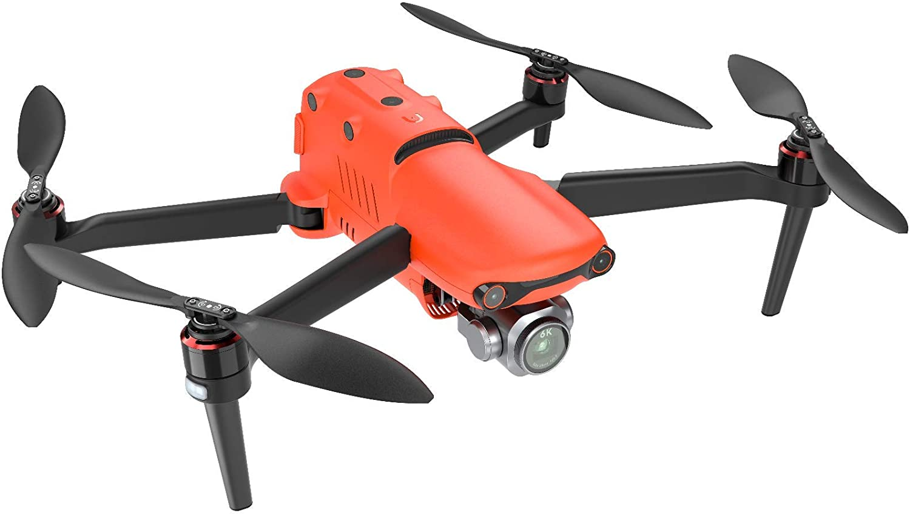

At flyve med droner er en spændende oplevelse, fordi du kan tage flotte landskabsbilleder. Der er dog mange droner på markedet, så hvordan kan du finde ud af, hvad der er den bedste for dig? Her har du en liste med de bedste droner i 2020, hvor vi kommer ind på deres funktioner og hvilke fordele de hver og især har.

## 1. Autel EVO 2 Pro

Evo II Pro-versionen henvender sig mere til professionelle fotografer og filmskabere.

Selvom Pro-versionen “kun” tilbyder 6K-opløsning, kan du stadig forvente klarere og mere detaljerede billeder, da den er udstyret med en større 1-tommer billedsensor sammenlignet med 1/2-tommers billedsensor fra Evo II 8K.

Derudover har fotoentusiaster fuld kamerakontrol med en justerbar blænde (f / 2.8 til f / 11).

Pros

- Utrolig batterilevetid - godt over en halv time pr. Flyvning

- Ingen geofencing - i sidste ende hvad skubbede mig til at købe dette som min første drone over DJI

- Fremragende til at undgå forhindringer den møde - denne ting har kameraer og ultralyd, der dækker de fleste vinkler, hvilket gør det sværere at støde på ting

- Video og fotos er fremragende ved standardindstillingerne.

- Video op til 120FPS, hvilket er fantastisk til slowmotio

- Mere fleksibilitet: Evo 2 har et udskifteligt kameramodul, hvilket betyder, at man kan skifte mellem Pro-, standard- og dual (infrarødt og synligt lys) kamerasystem.

- En controller til både at køre drone og se videofeed

- Leveres med 32 GB Sandisk Extreme-kort, så du er klar til at flyve, når du modtager dronen

Cons

- Casen den opbevares i er meget stor og er ikke nem at bære rundt på

- Det lidt mere støjende end en Mavic Air 2

### Videoanmeldelse

 <iframe width="340" height="200" style="          position: absolute,
          top: 0,
          left: 0,
          width: 100%,
          height: 100%"
src="https://www.youtube.com/embed/u509D_U4RPM" SameSite=None
frameborder="0" 
allow="accelerometer; autoplay; encrypted-media; gyroscope; picture-in-picture" 
allowfullscreen></iframe>

<a href="https://www.partner-ads.com/dk/klikbanner.php?partnerid=29353&bannerid=77671&htmlurl=https://www.droneland.dk/da/home/920-autel-evo-2-pro-6k1-drone-med-fuld-1-sony-sensor-og-6k-kamera-fly-more-bundle-6924991101024.html" target="_blank"  style="background-color:#f44336; 
	border-radius:28px;
	border:1px solid #f44336;
	display:inline-block;
	cursor:pointer;
	color:#ffffff;
	font-family:Arial;
	font-size:17px;
	padding:16px 31px;
	text-decoration:none;
	text-shadow:0px 1px 0px #2f6627;" >Tjek Autel EVO 2 Pro Pris</a>

## 2. DJI Mavic 2 Pro - Fly More Combo

DJI Mavic pro er et stor navn på dronemarkedet og alle deres produkter er intet mindre end fremragende. Hvis du ser på Mavic Pro du vil se endnu en fantastisk DJI-drone
foran dig.

Mavic 2 pro har flere innovationer, f.eks er
kameraet nu meget større. Du har flere sensorer som hjælper med at undgå koalitioner. Dertil er hele designet meget mere kompakt

Denne model er hurtigere og meget mere støjsvag end
den originale Mavic pro og den vejer ca. 297 gram. Det gør at den passer ind i enhver typerygsæk endda en håndtaske.

Med denne drone får du 8 gigabyte lagring samt et microSD-slot, der kan gemme op til 128 gigabyte ekstra plads.

Du kan overføre dine fotos og optagelser til din computer ved hjælp af USBC-port, du kan endda tilslutte din
drone til en computer for at opdatere dens firmware.

DJI Mavic 2 Pro er den bedste drone på markedet med overlegen billed- og videokvalitet, flere sensorer, som hjælper med at undgå forhindringer og fremragende batterilevetid.

Pros

- Bedste drone med kamera
- Lavere støjniveau
- Øget hastighed
- Længere batterilevetid
- Billeder og video i 4k

Cons

- PPI er ikke særlig høj
- Ingen tekst til tale

### Videoanmeldelse

 <iframe width="340" height="200" style="          position: absolute,
          top: 0,
          left: 0,
          width: 100%,
          height: 100%"
src="https://www.youtube.com/embed/q1Hks_NieMk" SameSite=None
frameborder="0" 
allow="accelerometer; autoplay; encrypted-media; gyroscope; picture-in-picture" 
allowfullscreen></iframe>

 
<a href="https://www.partner-ads.com/dk/klikbanner.php?partnerid=29353&bannerid=77671&htmlurl=https://www.droneland.dk/da/home/491-dji-mavic-2-pro-startpakke-drone-med-hasselblad-kamera-og-tilbehorspakke-6958265174445.html" target="_blank"  style="background-color:#f44336; 
	border-radius:28px;
	border:1px solid #f44336;
	display:inline-block;
	cursor:pointer;
	color:#ffffff;
	font-family:Arial;
	font-size:17px;
	padding:16px 31px;
	text-decoration:none;
	text-shadow:0px 1px 0px #2f6627;" >Tjek DJI Mavic Pro Pris</a>

## 3. DJI Mavic 2 Zoom - Fly More Combo

Det første du bemærker ved DJI Mavic 2 Zoom er dens design. Den vejer mere end tidligere DJI pro modeller. Batteriet er større som giver mere flyvetid.

Dens største feature er helt klart dens optiske zoom som kan kontrolleres med din remote controller. Med den kan du zoome ind og ud hvor overgangen føles meget glat.

2 led lygter et tilsluttet på bunden af dronen. De kan slukkes og tændes ved hjælp af din remote controller. Med dem kan du spotte din drone i selv dagslys og om aftenen.

Dronens hastighed har også set en forbedring. Den har nu en top hastighed på 72 km/t og dens flyvetiden er i følge DJI firmaet på 31 min.

Dens kamera sensorer bruger det samme kamera som den tidligere Mavic Pro hvilket er en smule ærgeligt. Ikke det stor mindre kan du stadig tage flotte billeder, men ikke i så høj kvalitet som Mavic 2 Pro.

Alt i alt er Mavic 2 Zoom en faktisk drone som er blevet forbedret på flere fronter. Med et moderne design og et godt kamera er du godt klædt på til at få taget nogle gode landskabsbilleder og video timelapses.

Pros

- Optisk zoom
- Mere flyvetid
- 2 led lygter så dronen hurtigt kan spottes
- Forbedret batterilevetid
- Billeder og video i 4k

Cons

- Kameraet er den samme som den originale Mavic Pro

### Videoanmeldelse

 <iframe width="340" height="200" style="          position: absolute,
          top: 0,
          left: 0,
          width: 100%,
          height: 100%"
src="https://www.youtube.com/embed/B_xOgjoCKZM" SameSite=None
frameborder="0" 
allow="accelerometer; autoplay; encrypted-media; gyroscope; picture-in-picture" 
allowfullscreen></iframe>

<a href="https://www.partner-ads.com/dk/klikbanner.php?partnerid=29353&bannerid=77671&htmlurl=https://www.droneland.dk/da/home/493-dji-mavic-2-zoom-startpakke-drone-med-zoom-kamera-og-tilbehorspakke-6958265174452.html" target="_blank"  style="background-color:#f44336; 
	border-radius:28px;
	border:1px solid #f44336;
	display:inline-block;
	cursor:pointer;
	color:#ffffff;
	font-family:Arial;
	font-size:17px;
	padding:16px 31px;
	text-decoration:none;
	text-shadow:0px 1px 0px #2f6627;" >Tjek DJI Mavic 2 Zoom Pris</a>

## 4. DJI Mavic Mini - Fly More Combo

DJI Mavic Mini er DJI's seneste skud i stammen. Dronen er specifikt tilegnet nybegyndere. En ting som gør drone speciel er dens vægt. Den vejer nemlig under 250 gram.

Det gør den meget nemt kan bæres rundt på i din taske. Dronen er 130 mm i længde, 80 mm bred og 60 mm høj.

Kameraet er 12 mega pixel som kan tage flotte billeder i 2.7K som er en opløsning tæt på 4K.

En anden ting som gør dronen meget special er dens pris. Hvis du køber med <a href="https://www.partner-ads.com/dk/klikbanner.php?partnerid=29353&bannerid=55216&htmlurl=https://www.hubshop.dk/shop/dji-mavic-mini-combo-startpakke" target="_blank">Fly more combo</a> kommer prisen til at ligge på 3.895,00 kr hvilket er en meget attraktiv pris for begyndere.

DJI Mavic Mini har indbygget sensorer i bunden som kan hjælpe med at dronen kan lande sikkert.

Om du er erfaren med at flyve med droner eller er en nybegynder er DJI Mavic Mini værd at overveje givet dens pris og fleksibilitet.

Pros

- God billig drone
- God begynder drone
- Vejer meget lidt

Cons

- Filmer ikke I 4K

### Videoanmeldelse

 <iframe width="340" height="200" style="          position: absolute,
          top: 0,
          left: 0,
          width: 100%,
          height: 100%"
src="https://www.youtube.com/embed/pv97fCP13SE" SameSite=None
frameborder="0" 
allow="accelerometer; autoplay; encrypted-media; gyroscope; picture-in-picture" 
allowfullscreen></iframe>

<a href="https://www.partner-ads.com/dk/klikbanner.php?partnerid=29353&bannerid=77671&htmlurl=https://www.droneland.dk/da/home/791-1521-dji-mavic-mini-mikro-drone-med-kamera-6958265192869.html#/131-vaelg_model_-basispakke" target="_blank"  style="background-color:#f44336; 
	border-radius:28px;
	border:1px solid #f44336;
	display:inline-block;
	cursor:pointer;
	color:#ffffff;
	font-family:Arial;
	font-size:17px;
	padding:16px 31px;
	text-decoration:none;
	text-shadow:0px 1px 0px #2f6627;" >Tjek DJI Mavic Mini Pris</a>

