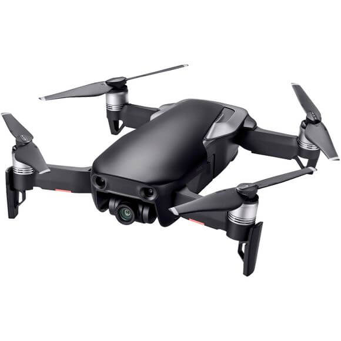
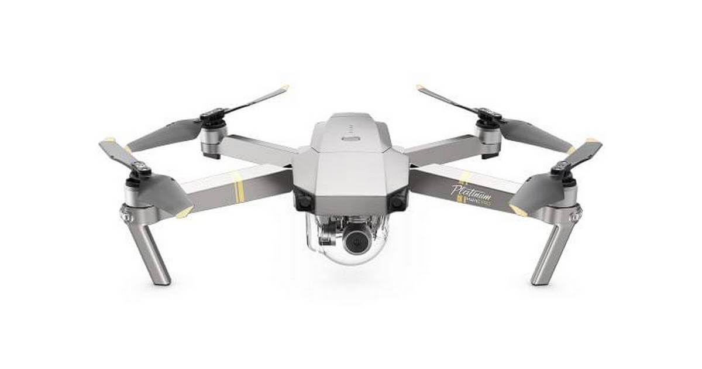

At læse e-bøger er en spændende oplevelse, og det kan også hjælpe dig med at nyde din tid, mens du er på farten. Der er dog mange e-bog-læsere på markedet, så hvordan kan du finde ud af, hvad der er den bedste for dig? Her har du en liste med de bedste muligheder, samt en liste over deres funktioner og fordele.

## 1. DJI Mavic 2 Pro

Amazon Kindle har stadig nogle af de bedste funktioner, som du kan finde på markedet. Det er en meget god e-bog-læser, den har justerbare frontlamper, hvilket betyder, at du kan læse i mange timer uden at stoppe. Derudover er skærmen fri for enhver blænding, noget der gør det nemt for dig at læse, selvom du er i direkte sollys.

Den nyere version af Kindle har også nogle gode funktioner som oversættelse af ord, justering af tekststørrelse uden at forlade siden og finde orddefinitioner. Der er endda en mulighed for at fremhæve passager, der også kan være nyttige. De har mulighed for at få adgang til Prime-læsning og få gratis adgang til masser af titler.

Batteriets levetid kan også vare i uger på grund af de intelligente displayindstillinger. Du har også Audible support, som gør lytter til lydbøger til en eksplosion. I dette tilfælde vil du måske gå med et batteri med større kapacitet, bare for at være sikker.

Pros

- Justerbart frontlys
- Distraktionsfri læsning
- Support til lydbog
- Lang batterilevetid

Cons

- PPI er ikke særlig høj
- Ingen tekst til tale

### Videoanmeldelse

 <iframe width="340" height="200" style="          position: absolute,
          top: 0,
          left: 0,
          width: 100%,
          height: 100%"
src="https://www.youtube.com/embed/q1Hks_NieMk" SameSite=None
frameborder="0" 
allow="accelerometer; autoplay; encrypted-media; gyroscope; picture-in-picture" 
allowfullscreen></iframe>

<a href="#" target="_blank"  style="background-color:#f44336; 
	border-radius:28px;
	border:1px solid #f44336;
	display:inline-block;
	cursor:pointer;
	color:#ffffff;
	font-family:Arial;
	font-size:17px;
	padding:16px 31px;
	text-decoration:none;
	text-shadow:0px 1px 0px #2f6627;" >Tjek Pris Her</a>

## 2. DJI Mavic 2 Zoom

Mens Amazon Kindle Oasis har en højere pris sammenlignet med de fleste e-bog-læsere, kommer den også med en ret premium fornemmelse. Dette er den letteste og tyndeste tænder. Dertil kommer, at det har den længste batterilevetid derude, hvis du har batteriopladningsdækslet, vil dette vare i flere måneder uden problemer.

300 PPI-opløsningen er en af ​​de bedste på markedet, og den giver bestemt en meget god brugeroplevelse uden at haste. Der er ingen blænding, som mange mennesker vil synes meget hjælpsomme og tiltalende.

Der er også tilpasningsmuligheder, såsom justering af tekststørrelse, ændring af skrifttyper og så videre. Du har også et indbygget justerbart lys, der lyser skærmen for at give dig en perfekt læseoplevelse hver gang. Du vil synes, det fungerer meget godt, og resultaterne er svimlende, hver gang du bruger det.

Nogle af de tilføjede Amazon Kindle Oasis-funktioner inkluderer side-drejeknapper, automatisk roterende sideretning, justerbart varmt lys og automatisk justering af lyssensorerne.

Pros

- Meget tynd og let
- Auto-justerbare lysstyrkeniveauer
- 300 PPI
- Den bedste batterilevetid

Cons

- Nogle folk kan havde problemer med skærmen
- Softwareproblemer til tider

### Videoanmeldelse

 <iframe width="340" height="200" style="          position: absolute,
          top: 0,
          left: 0,
          width: 100%,
          height: 100%"
src="https://www.youtube.com/embed/B_xOgjoCKZM" SameSite=None
frameborder="0" 
allow="accelerometer; autoplay; encrypted-media; gyroscope; picture-in-picture" 
allowfullscreen></iframe>

<a href="#" target="_blank"  style="background-color:#f44336; 
	border-radius:28px;
	border:1px solid #f44336;
	display:inline-block;
	cursor:pointer;
	color:#ffffff;
	font-family:Arial;
	font-size:17px;
	padding:16px 31px;
	text-decoration:none;
	text-shadow:0px 1px 0px #2f6627;" >Tjek Pris Her</a>

## 3. DJI Mavic Air

Når du bruger Kobo Aura, vil du kunne lide dens enkelhed og stor opmærksomhed på detaljer. Kobo Aura har et justerbart komfortlys uden at skulle bekymre sig om øjenbelastning. Desuden har de en dedikeret butik med 5 millioner e-bøger. Desuden tilbyder de personlige henstillinger, så oplevelsen er meget spændende og unik på samme tid.

Selvom produktet ikke er vandtæt, har du en meget let 212 PPI-enhed, som du kan medbringe med dig overalt, hvor du vil hen. Du har adgang til et væld af understøttede formater, meget mere end den almindelige Kindle, som er et stort plus. De har også 11 skrifttyper og 40 størrelser at vælge imellem. Batteriets levetid er også stor, varer i mange uger.

Pros

- optisk zoom
- Masser af skrifttyper og tilpasninger
- God kvalitet

Cons

- Problemer med berøringsskærm til tider
- Nogle formater ser ikke godt ud på enheden.

### Videoanmeldelse

 <iframe width="340" height="200" style="          position: absolute,
          top: 0,
          left: 0,
          width: 100%,
          height: 100%"
src="https://www.youtube.com/embed/T6Gv07_bTiw" SameSite=None
frameborder="0" 
allow="accelerometer; autoplay; encrypted-media; gyroscope; picture-in-picture" 
allowfullscreen></iframe>

<a href="https://www.partner-ads.com/dk/klikbanner.php?partnerid=29353&bannerid=67757&htmlurl=https://www.proshop.dk/Droner-Helikopter/DJI-Mavic-Air-Fly-More-Combo-Onyx-Black/2641448" target="_blank"  style="background-color:#f44336; 
	border-radius:28px;
	border:1px solid #f44336;
	display:inline-block;
	cursor:pointer;
	color:#ffffff;
	font-family:Arial;
	font-size:17px;
	padding:16px 31px;
	text-decoration:none;
	text-shadow:0px 1px 0px #2f6627;" >Tjek Pris Her</a>

## 4. DJI Mavic Pro Platinum

Hvis du vil have en anden, unik e-bog-læser, skiller Pocketbook Touch Lux sig ganske meget. I modsætning til andre produkter med berøringsskærm har denne også fysiske knapper. Så selvom du kan lide at røre ved skærmen, har du nogle gange brug for knapper, og de vil hjælpe dig meget. Det justerbare belysningssystem er meget nyttigt. Det har ikke nogen blænding, i stedet kan du læse, selvom du er i bevægelse.

8 GB intern hukommelse er meget god, og du kan gemme tusinder af bøger i den uden bekymringer. Der er endda et micro SD-slot, så du kan gå op til 32 GB lagerplads. De understøtter ikke indhold af lydbøger her, hvilket er en skam. Men på den anden side vil det give dig en meget god læseoplevelse. Batteriets levetid går op til en måned, hvilket er fantastisk.

Pros

- Mindre støjende
- Øget flyvetud
- Meget let at læse
- Store specifikationer

Cons

- Ikke den bedste e-boghandel
- Internetbrowser kan forbedres
- Forældet brugergrænseflade
- Der er ikke noget farvetemperaturlys

### Videoanmeldelse

 <iframe width="340" height="200" style="          position: absolute,
          top: 0,
          left: 0,
          width: 100%,
          height: 100%"
src="https://www.youtube.com/embed/GyFSXWS6RhI" SameSite=None
frameborder="0" 
allow="accelerometer; autoplay; encrypted-media; gyroscope; picture-in-picture" 
allowfullscreen></iframe>

<a href="#" target="_blank"  style="background-color:#f44336; 
	border-radius:28px;
	border:1px solid #f44336;
	display:inline-block;
	cursor:pointer;
	color:#ffffff;
	font-family:Arial;
	font-size:17px;
	padding:16px 31px;
	text-decoration:none;
	text-shadow:0px 1px 0px #2f6627;" >Tjek Pris Her</a>
